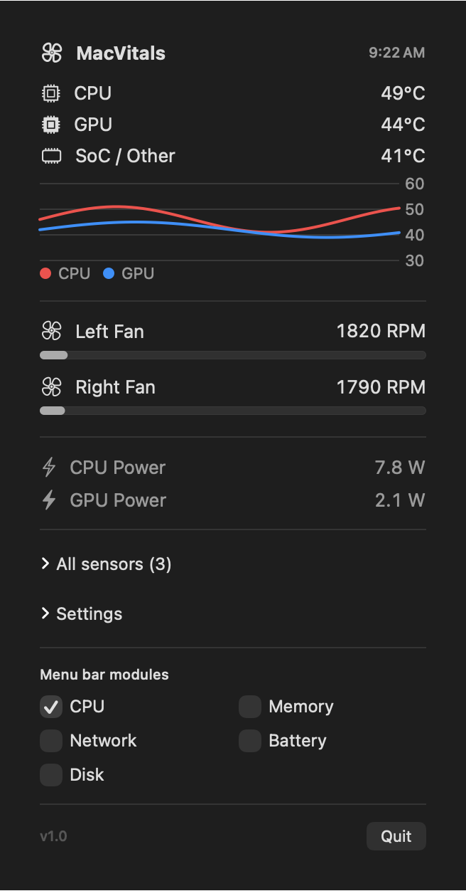
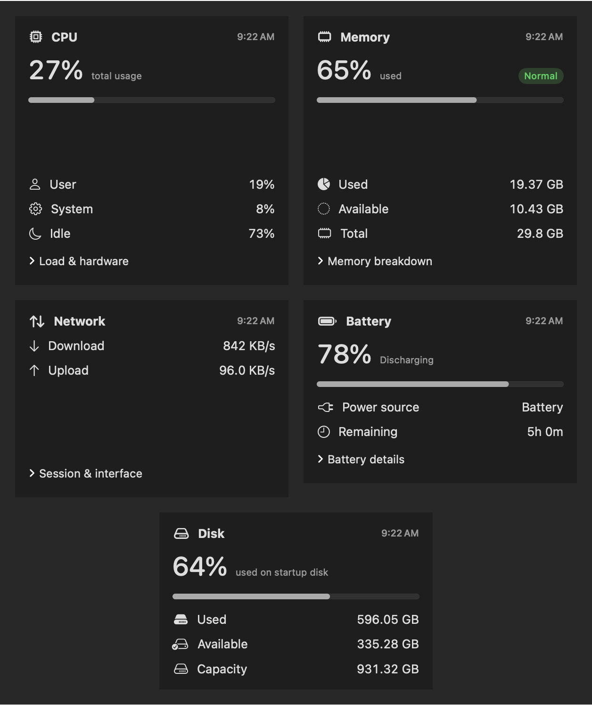

<!-- Hallmark · macrostructure: Workbench · pre-emit critique: P5 H5 E5 S5 R5 V5 · GitHub-native, utilitarian, screenshot-led · slop: pass -->

# MacVitals

A private, native macOS menu-bar monitor for temperatures, fans, CPU, memory,
network, battery, and disk.

No telemetry. No network requests. No fan control. Everything stays on your Mac.

<p align="center">
  
</p>

## Run MacVitals

MacVitals is currently a **source-only release**. There is no signed DMG yet.
You do not need a paid Apple Developer account to build and run the menu-bar app
on your own Mac.

You need macOS 14 or later, Xcode 16 or later, and an Apple Silicon Mac for the
best-supported experience.

```bash
git clone https://github.com/muneerahm/MacVitals.git
cd MacVitals

xcodebuild -project MacVitals.xcodeproj -scheme MacVitals \
  -configuration Debug \
  -derivedDataPath build/DerivedData \
  CODE_SIGNING_ALLOWED=NO CODE_SIGNING_REQUIRED=NO build

open build/DerivedData/Build/Products/Debug/MacVitals.app
```

MacVitals opens in the menu bar. Temperature and CPU are visible by default;
Memory, Network, Battery, and Disk can be enabled at the bottom of the Thermals
popover.

> The unsigned build runs the menu-bar app but cannot use the Notification Center
> widget's shared App Group. Widget development requires a signing team and an App
> Group you control. A public, notarized download requires Apple Developer Program
> membership.

Prefer Xcode? Open `MacVitals.xcodeproj`, select the **MacVitals** scheme, and run
it. If Xcode asks for signing, choose your team and use unique bundle IDs and an
App Group you control, or use the unsigned Terminal command above.

## What it shows

- **Thermals:** CPU, GPU, and SoC temperatures, fan RPM, power draw, history, and
  a full sensor browser.
- **CPU and memory:** usage, load, memory pressure, breakdowns, and five-minute
  charts.
- **Network:** local upload/download rates and session totals. It does not inspect
  packets, hosts, connections, public IP, Wi-Fi SSID, or MAC addresses.
- **Battery and disk:** charge, power state, remaining-time estimate, condition,
  and startup-volume capacity.
- **Useful controls:** °C/°F, polling interval, launch at login, overheat alerts,
  and optional CSV logging.
- **Read-only by design:** MacVitals never changes fan speeds or other hardware
  settings.



Each module has its own compact menu-bar value and popover. One shared sampler
keeps the app lightweight.

## Compatibility

| Mac | Support |
|---|---|
| M-series Pro / Max | Verified on development hardware |
| Other Apple Silicon Macs | Expected; sensor names vary by model |
| Fanless MacBook Air | Temperatures work; no fan readings by design |
| Intel Macs | Experimental and not in the release test matrix |

MacVitals uses undocumented Apple sensor interfaces for some thermal data, so a
future macOS update may change which readings are available. CPU, memory, network,
battery, and disk use local macOS system APIs.

See [Compatibility](docs/COMPATIBILITY.md) for the full hardware matrix and error
handling, or [Support](docs/SUPPORT.md) if a value is missing or looks wrong.

## Privacy

MacVitals makes no network requests and includes no telemetry, analytics, ads, or
third-party runtime dependencies. Settings and readings remain local. A CSV file
is written to `~/Documents/MacVitals/macvitals-log.csv` only when logging is
enabled.

Read the complete [privacy and security notes](SECURITY.md).

## Contributing and testing

Hardware reports are especially useful for MacBook Air and Intel models. Open an
[issue](https://github.com/muneerahm/MacVitals/issues) with your Mac model, macOS
version, and which readings appeared. Do not include serial numbers or private
system details.

Run the test suite without signing:

```bash
xcodebuild -project MacVitals.xcodeproj -scheme MacVitals \
  -destination 'platform=macOS,arch=arm64' \
  CODE_SIGNING_ALLOWED=NO CODE_SIGNING_REQUIRED=NO test
```

Developer references: [architecture and compatibility](docs/COMPATIBILITY.md) ·
[release checklist](docs/RELEASE-CHECKLIST.md) ·
[release audit](docs/AUDIT-REPORT.md)

## License

[MIT](LICENSE) © 2026 MacVitals contributors.
